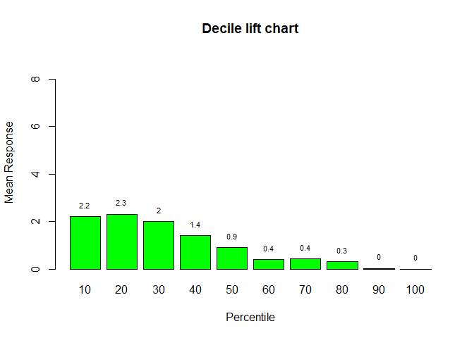

  


#Question 1

```r
options(scipen=999)

spam.df <- spamdatabase.df[ which(spamdatabase.df$spam == 1),]
spam_average.df <- colMeans(spam.df)
#data.frame(spam_average.df)

nonspam.df <- spamdatabase.df[ which(spamdatabase.df$spam == 0),]
nonspam_average.df <- colMeans(nonspam.df)
#data.frame(nonspam_average.df)

spam_nonspam.df <- data.frame(spam_average.df, nonspam_average.df, (spam_average.df - nonspam_average.df))
colnames(spam_nonspam.df) <- c("spam_Average", "nonspam_Average", "difference")

rownames(spam_nonspam.df) <-c( 
  "word_freq_make", 
  "word_freq_address", 
  "word_freq_all", 
  "word_freq_3ds",
  "word_freq_our",         
  "word_freq_over",  
  "word_freq_remove",
  "word_freq_internet",
  "word_freq_order",
  "word_freq_mail",
  "word_freq_receive",
  "word_freq_will",
  "word_freq_people",
  "word_freq_report",
  "word_freq_addresses",
  "word_freq_free",
  "word_freq_business",
  "word_freq_email",
  "word_freq_you",
  "word_freq_credit",
  "word_freq_your",
  "word_freq_font",
  "word_freq_000",
  "word_freq_money",
  "word_freq_hp",
  "word_freq_hpl",
  "word_freq_george",
  "word_freq_650",
  "word_freq_lab",
  "word_freq_labs",
  "word_freq_telnet",
  "word_freq_857",
  "word_freq_data",
  "word_freq_415",
  "word_freq_85",
  "word_freq_technology",
  "word_freq_1999",
  "word_freq_parts",
  "word_freq_pm",
  "word_freq_direct",
  "word_freq_cs",
  "word_freq_meeting",
  "word_freq_original",
  "word_freq_project",
  "word_freq_re",
  "word_freq_edu",
  "word_freq_table",
  "word_freq_conference",
  "char_freq_;",
  "char_freq_(",
  "char_freq_[",
  "char_freq_!",
  "char_freq_$",
  "char_freq_#",
  "capital_run_length_average",
  "capital_run_length_longest",
  "capital_run_length_total",
  "spam")

predictors <- spam_nonspam.df[order(-spam_nonspam.df$difference),]
head(predictors,10)
```

```
##                            spam_Average nonspam_Average  difference
## capital_run_length_total    470.6194153    161.47094692 309.1484684
## capital_run_length_longest  104.3932708     18.21449067  86.1787801
## capital_run_length_average    9.5191649      2.37730093   7.1418640
## spam                          1.0000000      0.00000000   1.0000000
## word_freq_you                 2.2645394      1.27034075   0.9941987
## word_freq_your                1.3803696      0.43870158   0.9416680
## word_freq_free                0.5183618      0.07358680   0.4447750
## char_freq_!                   0.5137126      0.10998350   0.4037291
## word_freq_our                 0.5139548      0.18104017   0.3329146
## word_freq_remove              0.2754054      0.00938307   0.2660223
```


```r
# Split the data into two parts: training (80%) and validation/test set (20%)

spam.avg <- colMeans(spam.df[,1:57])
nonspam.avg <- colMeans(nonspam.df[,1:57])
diff_average<- abs(spam.avg-nonspam.avg)
diff<- sort.list(diff_average,decreasing=TRUE)
indices <- head(diff,10)
columns <- c(indices,58)
data <- spamdatabase.df[,columns]
names(data) <- names(spamdatabase.df[,columns])
#indices <- spamdatabase.df[,head(diff,10)]

set.seed(42)
predictor_spam <- data
training.index <- createDataPartition(predictor_spam$spam, p= 0.8, list = FALSE)
training.df <- predictor_spam[training.index,]
validation.df <- predictor_spam[-training.index,]

# Normalize the data
# Estimate preprocessing parameters
norm.values <- preProcess(predictor_spam[,1:10], method = c("center", "scale"))
# Transform the data using the estimated parameters
spam.training.norm <- predict(norm.values, training.df)
spam.validation.norm <- predict(norm.values, validation.df)
#performing lda on the training data
spam.lda <- lda(spam~., data = spam.training.norm)
spam.lda
```

```
## Call:
## lda(spam ~ ., data = spam.training.norm)
## 
## Prior probabilities of groups:
##         0         1 
## 0.6036403 0.3963597 
## 
## Group means:
##   capital_run_length_total capital_run_length_longest
## 0               -0.1972143                 -0.1731675
## 1                0.2987029                  0.2820570
##   capital_run_length_average word_freq_george word_freq_you word_freq_your
## 0                -0.08767264        0.1492141    -0.2136983     -0.3096578
## 1                 0.15195010       -0.2275953     0.3381014      0.4624814
##   word_freq_hp word_freq_free word_freq_hpl `char_freq_!`
## 0    0.2193507     -0.2163270     0.1981605    -0.1887372
## 1   -0.3166362      0.3562333    -0.2875851     0.2942240
## 
## Coefficients of linear discriminants:
##                                    LD1
## capital_run_length_total    0.44705487
## capital_run_length_longest  0.08021456
## capital_run_length_average  0.05932892
## word_freq_george           -0.20073171
## word_freq_you               0.22116964
## word_freq_your              0.55810685
## word_freq_hp               -0.22728524
## word_freq_free              0.43430732
## word_freq_hpl              -0.16076750
## `char_freq_!`               0.28090431
```

```r
#Question 3
spam.lda$prior
```

```
##         0         1 
## 0.6036403 0.3963597
```

#Question4

#Coefficients of linear discriminant:                        
##                             LD1
## capital_run_length_total  0.4144
#capital_run_length_longest  0.0869
#capital_run_length_average  0.0651
#word_freq_george           -0.2013
#word_freq_you               0.2222
#word_freq_your              0.5557
#word_freq_hp               -0.2354
#word_freq_free              0.4338
#word_freq_hpl              -0.1654
#char_freq_!                 0.2963

#Analysis:

#The Coefficients of linear discriminants are the coefficients for each discriminant which describes the amount of variation in the model.
#LD1 is the linear combination of (capital_run_length_total*0.4144) + (capital_run_length_longest*0.0869) + (capital_run_length_average*0.0651) + (word_freq_you*-0.2013) +(word_freq_your*0.2222) + (word_freq_free*0.5557) + (char_freq_!*-0.2354) + (word_freq_our*0.4338) + (word_freq_remove*-0.1654) + (word_freq_000*0.2963)


```r
# 5.Predict
pred.valid <- predict(spam.lda, spam.validation.norm,type = 'response')
summary(pred.valid)
```

```
##           Length Class  Mode   
## class      920   factor numeric
## posterior 1840   -none- numeric
## x          920   -none- numeric
```
#Question7

```r
#LDA plot for Training dataset
lda_train <- lda(spam~., data = spam.training.norm)
plot(lda_train, main="LDA plot for Training dataset")
```

<!-- -->

```r
#LDA plot for Validation dataset
lda_valid <- lda(spam~., data = spam.validation.norm)
plot(lda_valid, main="LDA plot for Validation dataset")
```

<!-- -->
#Analysis:
#We can see that the non spam category is having values present less than 0 for both training and validation dataset

#The spam category is also concentrated between before 4
#There is a same pattern for both validation and training datasets in spam and non spam category.Hence we can say that we have build a good model.


```r
#9.lift chart

gain <- gains(as.numeric(spam.validation.norm$spam), pred.valid$x[,1], groups = 10)
spam <- as.numeric(spam.validation.norm$spam)
plot(c(0,gain$cume.pct.of.total*sum(spam))~c(0,gain$cume.obs),
xlab = "# cases", ylab = "Cumulative", main = "", type = "l")
lines(c(0,sum(spam))~c(0, dim(spam.validation.norm)[1]), lty = 5)
title("Lift Chart")
```

<!-- -->

```r
## The first 20% of the totatl observations in gain chart shows the maximum lift which indicates that for first 20% cases there is a good lift in the number of spams. As the number of cases increase, the lift chart reduces the lift significantly. 

## Hence, we can concur that fo the initial few cases the lift is performed well and the gain has been maximized, indicating good model performance.  
```


```r
#decile chart
height <- gain$mean.resp/mean(spam.validation.norm$spam)
midpoints <- barplot(height, names.arg = gain$depth, ylim = c(0,9), col = "green",
xlab = "Percentile", ylab = "Mean Response",
main = "Decile lift chart")
text(midpoints, height+0.5, cex = 0.7, labels=round(height, 1))
```

<!-- -->

```r
# The decile chart shows the performance and the gain of the spam_predictors in the interval of 10 percentile each.Here after 30 percentile, the mean response shoots down significantly.
# Our main focus is the initial percentiles where we focus on maximizing the gain and here for 10% we have mean response = 2.2 and for 20% we have mean response of 2.3
# this model being positively skewed, says that the model is a good performer and the gains are high in the first 30 percentile observations.
```


```r
# Question 10
#  accuracy of model with probability = 0.5 and 0.2
pred_with_5 <- factor( ifelse(pred.valid$posterior[,2] >= 0.5, 1, 0) )
confusionMatrix(table(pred_with_5,spam.validation.norm$spam))
```

```
## Confusion Matrix and Statistics
## 
##            
## pred_with_5   0   1
##           0 520 118
##           1  46 236
##                                                
##                Accuracy : 0.8217               
##                  95% CI : (0.7954, 0.846)      
##     No Information Rate : 0.6152               
##     P-Value [Acc > NIR] : < 0.00000000000000022
##                                                
##                   Kappa : 0.6086               
##                                                
##  Mcnemar's Test P-Value : 0.00000002954        
##                                                
##             Sensitivity : 0.9187               
##             Specificity : 0.6667               
##          Pos Pred Value : 0.8150               
##          Neg Pred Value : 0.8369               
##              Prevalence : 0.6152               
##          Detection Rate : 0.5652               
##    Detection Prevalence : 0.6935               
##       Balanced Accuracy : 0.7927               
##                                                
##        'Positive' Class : 0                    
## 
```

```r
pred_with_2 <- factor( ifelse(pred.valid$posterior[,2] >= 0.2, 1, 0) )
confusionMatrix(table(pred_with_2,spam.validation.norm$spam))
```

```
## Confusion Matrix and Statistics
## 
##            
## pred_with_2   0   1
##           0 356  27
##           1 210 327
##                                                
##                Accuracy : 0.7424               
##                  95% CI : (0.7128, 0.7704)     
##     No Information Rate : 0.6152               
##     P-Value [Acc > NIR] : 0.0000000000000002442
##                                                
##                   Kappa : 0.5039               
##                                                
##  Mcnemar's Test P-Value : < 0.00000000000000022
##                                                
##             Sensitivity : 0.6290               
##             Specificity : 0.9237               
##          Pos Pred Value : 0.9295               
##          Neg Pred Value : 0.6089               
##              Prevalence : 0.6152               
##          Detection Rate : 0.3870               
##    Detection Prevalence : 0.4163               
##       Balanced Accuracy : 0.7764               
##                                                
##        'Positive' Class : 0                    
## 
```

```r
# to compare the accuracy of model with probability of 0.5 and 0.2, we have used confusion matrix
#the accuracy for pred_with_5 is '0.8207' and the accuracy for pred_with_2 is '0.7554'.
#As we can notice, the accuracy of model with probability 0.5 is more that 0.2. Hence the model where prob = 0.5 is better and should be used.
```

## Including Plots

You can also embed plots, for example:

<!-- -->

Note that the `echo = FALSE` parameter was added to the code chunk to prevent printing of the R code that generated the plot.
